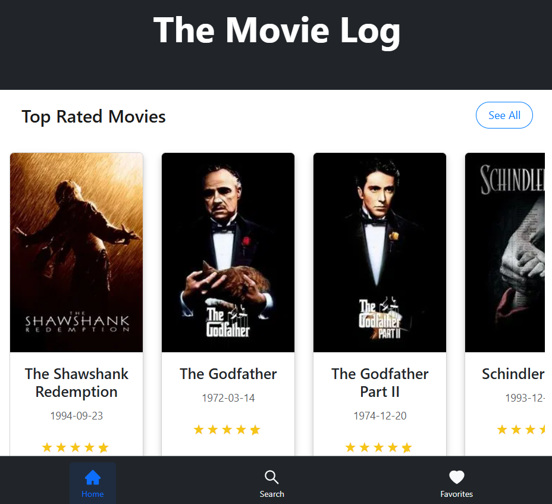
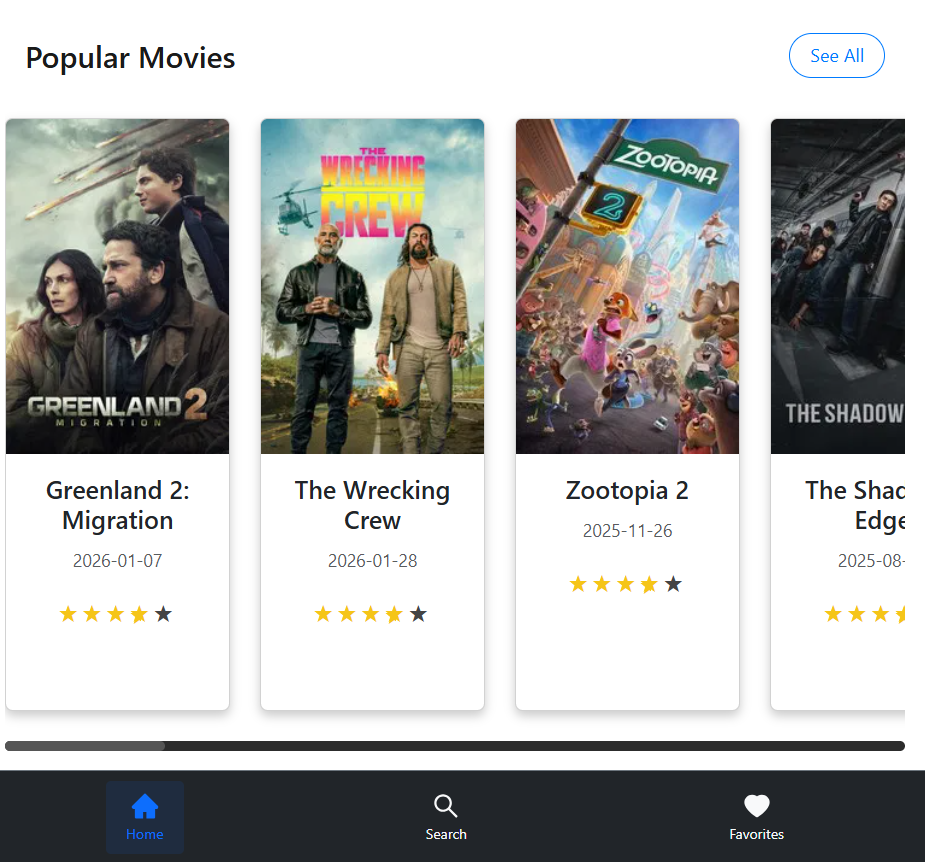
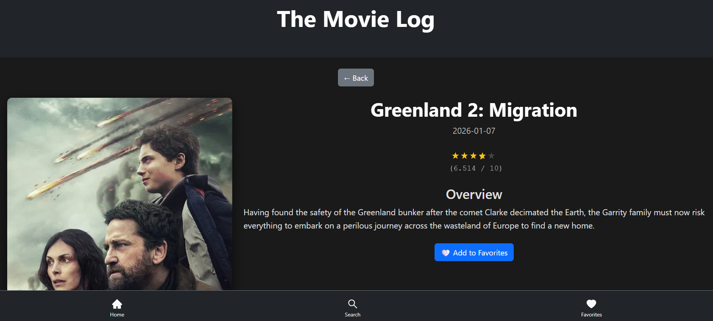
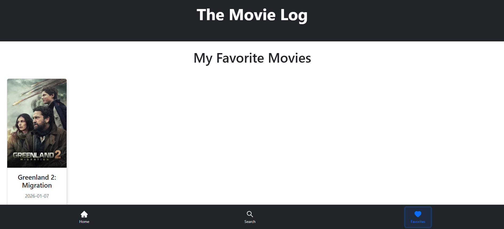
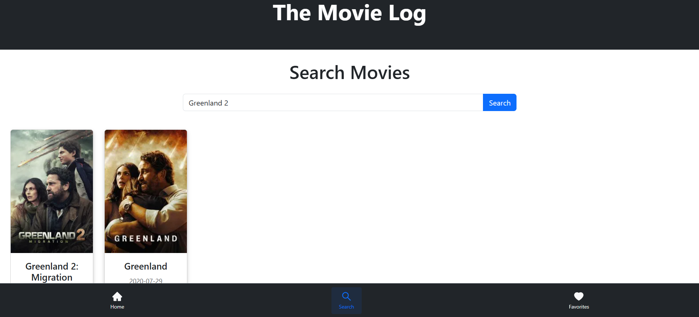

# 🎬 TMDB API Movie App

TMDB API Movie App is a web application that allows users to search and explore movies and TV shows. Built with React and Node.js, it fetches real-time data from TMDB API and displays it with a clean, responsive interface using Bootstrap and CSS.

---
## 🚀 Features

- **🔍 Search Movies and TV Shows:** Search for movies or TV shows by name.  
- **🎬 Detailed Information:** View detailed info about a movie or show, including release date and ratings.  
- **🔥 Discover Popular Content:** Browse trending and popular movies or TV shows.  
- **⭐ Personalized Lists:** Create and manage watchlists or favorite movies/shows.  

---
## 📸 Screenshots / Demo

<p align="center">
  
  
</p>

<p align="center">
  
</p>

<p align="center">
  
</p>

<p align="center">
  
</p>

---
## 🛠 Tech Stack

- **Frontend:** React, Bootstrap, CSS  
- **Backend:** Node.js  
- **API:** TMDB (The Movie Database)  
- **Version Control:** Git & GitHub  

---
## Getting Started

### Prerequisites
- [TMDb API Key](https://www.themoviedb.org/documentation/api): Sign up and generate an API key.
- Node.js and npm installed on your machine.

## 💻 Installation

1. Clone the repository:  
   ```sh
   git clone https://github.com/your-username/your-repo-name.git
   ````

2. Navigate into the project folder:
   ```sh
   cd your-repo-name
   ```

3. Install dependencies:
   ```sh
   npm install
   ```

4. Create a `.env` file in the root directory:
   ```sh
   REACT_APP_TMDB_API_KEY=your_api_key_here
   ```

5. Start the development server (Vite):
   ```sh
   npm run dev
   ```

6. Open your browser at the URL shown in the terminal
 (usually http://localhost:5173).

## ✨ Usage

* Open your browser and go to `http://localhost:5173`
* Search for movies or TV shows
* Click on a movie or show for detailed information
* Add movies/shows to your watchlist or favorites

## 🤝 Contributing

1. Fork the repository
2. Create a branch: `git checkout -b feature-name`
3. Make changes & commit: `git commit -m "Add feature"`
4. Push to your branch: `git push origin feature-name`
5. Open a Pull Request

---
